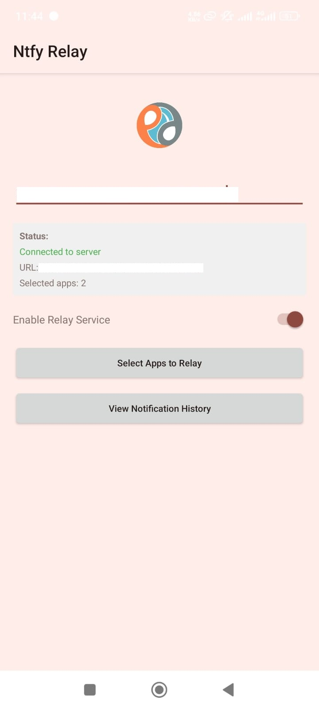
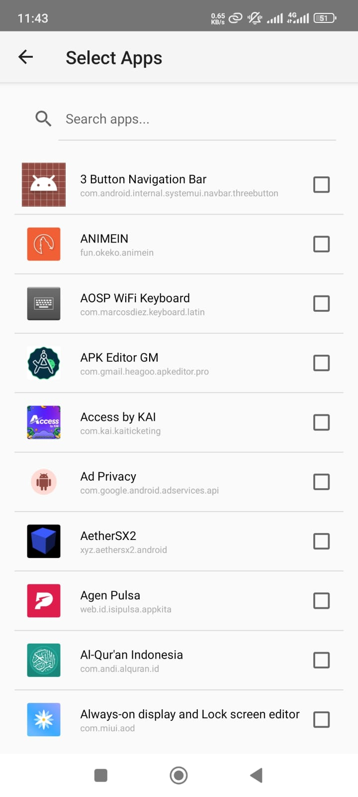

# ntfy Hook

ntfy Hook is a simple Android application designed to hook incoming notifications to an ntfy server. It provides an easy way to bridge notifications from your Android device to your preferred ntfy server, enabling you to receive notifications across multiple devices and platforms seamlessly.

## About This Fork

This is a fork of the original [ntfy Hook](https://github.com/ubaldop/ntfy-hook) project created by Ubaldo Porcheddu. This fork was created in April 2025 to address several critical issues and enhance functionality while maintaining compatibility with the original design.

### Key Improvements in this Fork:

- Fixed service persistence issues that caused notifications to stop after device restarts
- Added better notification handling and UI status indicators
- Enhanced error handling and connection reliability
- Improved permanent notification display for foreground service
- Fixed server connection state tracking for better status reporting
- Added more robust notification listener service binding
- Resolved force close issues when enabling the hook service

The goal of this fork is to provide a more stable and feature-rich version of the original application while maintaining its simplicity and efficiency. All improvements have been thoroughly tested on modern Android devices.

If you encounter any issues or have suggestions for further improvements, please open an issue in the repository.

## Screenshots

Here's what the app looks like:

## Features

- **Notification hook**: Listen for incoming notifications on your Android device and forward them to an ntfy server.
- **App Selection**: Choose which apps' notifications you want to forward.
- **Notification History**: View a complete history of all sent notifications with timestamps.
- **Status Indicators**: Real-time monitoring of service and connection status with color-coded indicators.
- **Automatic Recovery**: Service automatically restarts after device reboot.
- **Persistent Connection**: Keep-alive mechanism maintains a reliable connection to your ntfy server.
- **Easy Configuration**: Simple user interface for quick setup and management.

## How it Works

ntfy Hook works by intercepting notifications on your Android device and forwarding them to an ntfy server using a simple HTTPS request. The notification listener service runs in the background and monitors for new notifications from your selected apps. When a notification appears, it's immediately sent to your configured ntfy server, which then processes and delivers these notifications to your desired destinations, such as other devices or messaging platforms.

## Installation

To install ntfy Hook, follow these steps:

1. Clone this repository to your local machine.
2. Open the project in Android Studio.
3. Build and install the APK on your Android device.

Alternatively, you can download the APK file from the releases section and install it manually on your Android device.

## Configuration

Once installed, configure ntfy Hook with these simple steps:

1. Enter the URL of your ntfy server in the provided input field.
2. Select which apps you want to monitor for notifications.
3. Toggle the service on using the switch button.

The app validates your settings and ensures all requirements are met before activating the service.

## Usage

1. Launch ntfy Hook on your Android device.
2. Grant the necessary permissions for the app to access notifications when prompted.
3. Configure the ntfy server URL.
4. Select which apps' notifications should be hooked.
5. Enable the hook service using the toggle switch.
6. The app will display the current connection status and maintain a persistent notification while running.
7. View your notification history through the "View Notification History" button.

## Recent Improvements

### Fixed Issues

- **Persistent Service**: App now continues sending notifications after phone restarts through the BootReceiver component.
- **App Selection Reliability**: Fixed issues with notifications stopping when frequently changing selected apps.

### Enhanced Features

- **Notification History**: Complete tracking system for all sent notifications with details and timestamps.
- **Status Indicators**: Comprehensive status display showing service state, server connection, and app selection.
- **Improved Validation**: Prevents activation with missing URL or no selected apps, with clear error messages.
- **Keep-Alive Mechanism**: Reliable foreground service with periodic connection checks and automatic reconnection.

## Technical Details

- Runs as a proper foreground service with a persistent notification.
- Uses efficient data management with SharedPreferences and Gson.
- Implements singleton patterns for key managers.
- Comprehensive error logging and recovery mechanisms.
- Well-organized code structure with specialized manager classes.

## License

ntfy Hook is released under the [GPL-3.0](LICENSE).
