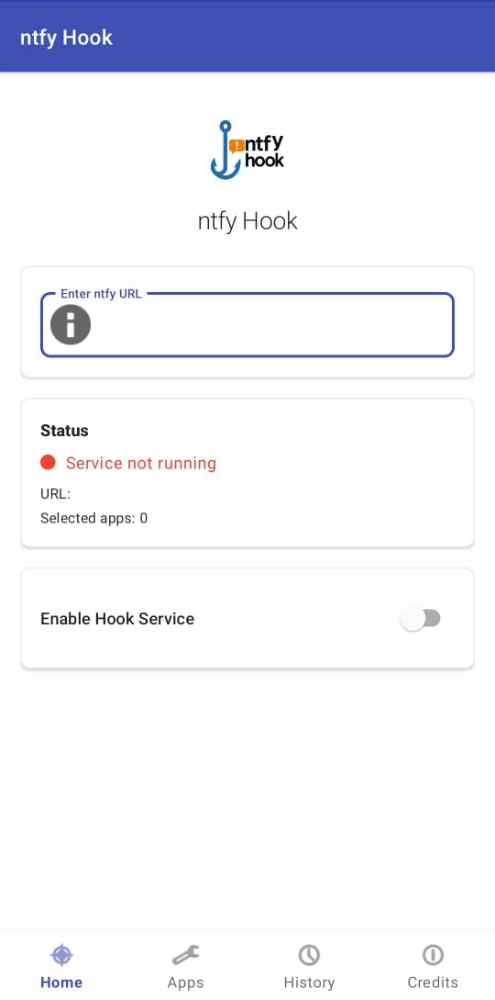
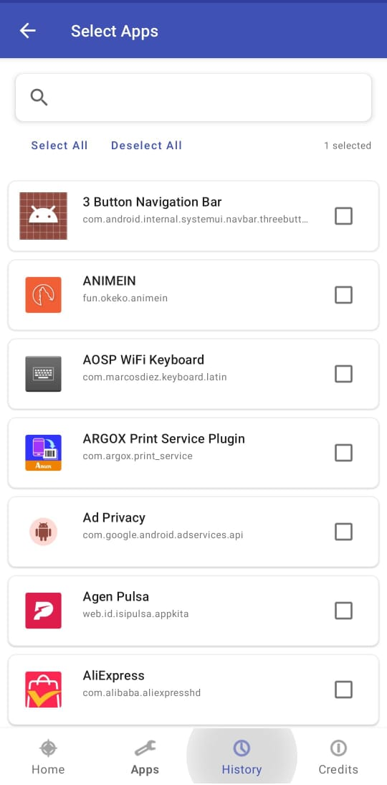
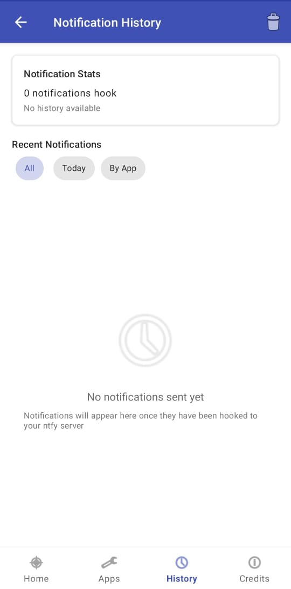
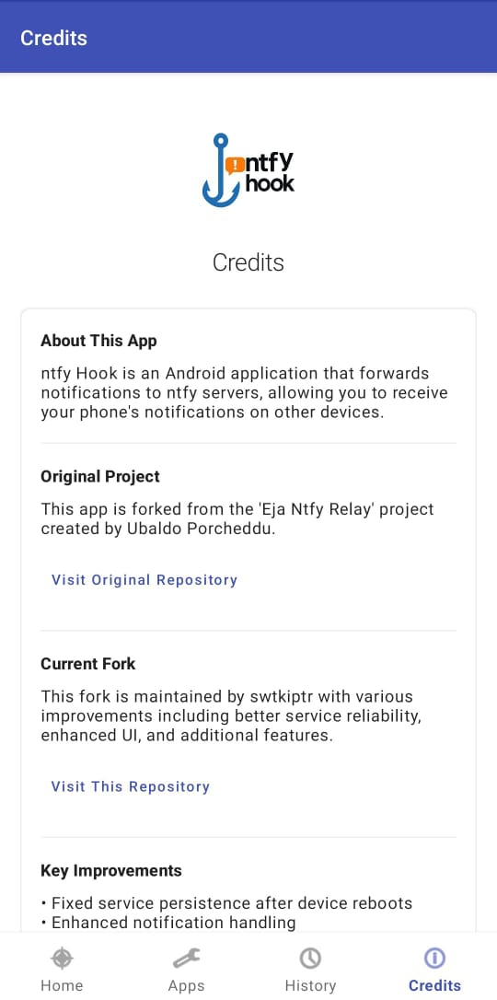

# ntfy Hook

  

  <strong>Your notifications, anywhere, anytime.</strong>
  
A simple and reliable Android app for forwarding notifications to ntfy servers.

  
  
  

 

## 📱 Overview

ntfy Hook forwards Android notifications to any ntfy server, offering:
- Cross-device notification syncing
- Selective app forwarding
- Notification history
- Real-time connection status

Forked from [ntfy-relay](https://github.com/eja/ntfy-relay) with enhanced reliability.

## ✨ Features

- Choose apps for notification forwarding
- View notification history
- Auto-restart after device reboot
- Simple setup with server URL

## 📸 Screenshots

  
  
  
  

## 🚀 Improvements

- Fixed service persistence
- Better error handling
- Improved UI with status indicators
- Reliable server connections
- Resolved force-close bugs

## 📋 Installation

### From Source
1. Clone: `git clone https://github.com/swtkiptr/ntfy-hook.git`
2. Build in Android Studio
3. Install and grant notification access

### Direct Install
1. Download APK from [releases](https://github.com/swtkiptr/ntfy-hook/releases)
2. Install (enable "unknown sources")
3. Grant notification access

### F-Droid
1. Coming soon to F-Droid
2. Will be available at: [F-Droid](https://f-droid.org)
3. Includes reproducible builds and F-Droid metadata
4. Follows F-Droid best practices

## 📚 Usage

1. Grant notification access (Allow Restricted Setting)
2. Set ntfy server URL
3. Select apps
4. Enable service

## 📄 License

[GPL-3.0](LICENSE)

## 🙏 Acknowledgements

- Original: [Eja](https://github.com/eja/ntfy-relay)
- Enhanced by: [swtkiptr](https://github.com/swtkiptr)

For issues or contributions, visit the [GitHub repository](https://github.com/swtkiptr/ntfy-hook).
